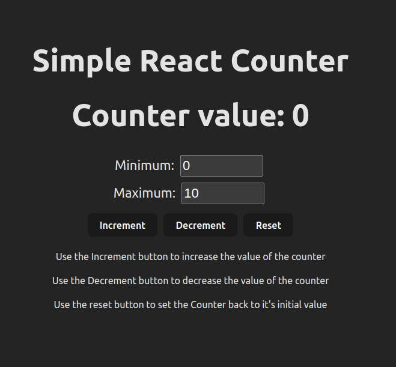

# Simple React Counter

This is a simple React application that implements a counter functionality. You can set minimum and maximum values, increment, decrement, and reset the counter. The application also displays an error message if the counter value goes beyond the specified minimum and maximum limits.

## View the deployed site
[View Site]('https://counter-6v4849gnp-nithin-sivakumars-projects.vercel.app/')

## Demo

Watch the demo video to see the application in action:

[](./demo/counter-demo.mp4)

## Getting Started

To get started with this project, follow these steps:

1. **Clone the repository:**
   ```sh
   git clone <repository-url>
   cd <repository-folder>
   ```
2. Run the application:
    ```
    npm start
    ```
3. Open your browser:
Open your web browser and go to 'http://localhost:3000' to view the application.

## Usage
* Set the minimum and maximum values for the counter using the input fields.
* Click the "Increment" button to increase the counter value.
* Click the "Decrement" button to decrease the counter value.
* Click the "Reset" button to reset the counter value to the initial value.

## Features
* <b>Dynamic Limits:</b> Set custom minimum and maximum values for the counter.
* <b>Error Messages:</b> Displays error messages if the counter value exceeds the specified limits.
* <b>Informative:</b> Provides additional information when the counter is at zero.
* <b>Simple and Intuitive:</b> User-friendly interface for a seamless user experience.

## Technologies Used
* <b>React:</b> A JavaScript library for building user interfaces.
* <b>CSS:</b> Styles have been implemented using CSS for a clean and responsive design.
